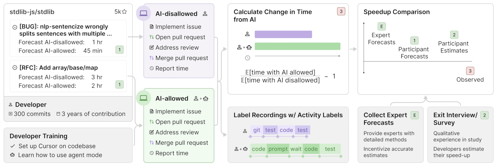
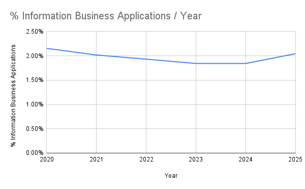
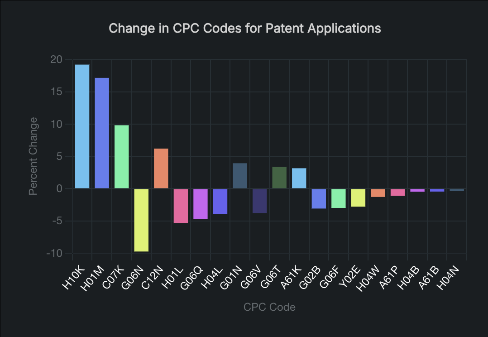
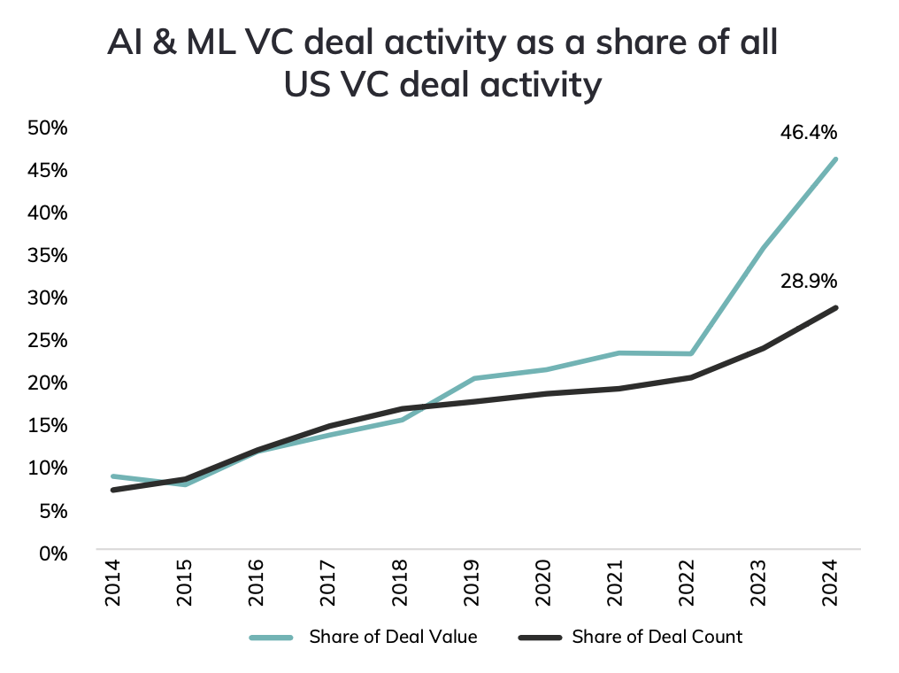
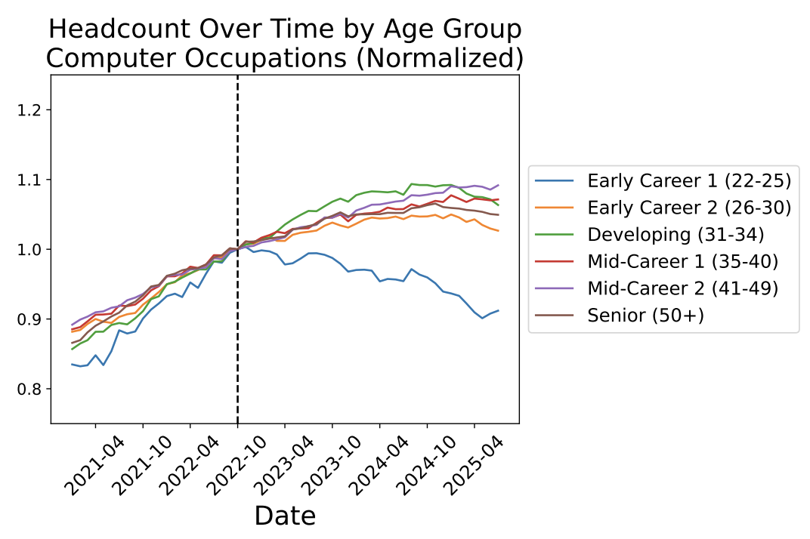

## The Sunset of the Software Engineer?

There's much clamor nowadays concerning the outlook of software engineering in an AI-saturated world - and for good reason. Even just 5 years after their widespread advent, large language models have already revolutionized the way we work. Those using AI-assistants now code in a fundamentally way than those who don't - likely just as much time is spent interacting with an AI as writing code.

This shift raises a number of questions, all of which I'd argue are important:

- What is this doing to our hard skills? Will our capacity to program atrophy as we delegate our programming tasks?
- Does this even matter? Is this shift akin to [books](https://rleighturner.com/the-shallows/#:~:text=%E2%80%9CShould%20the%20Egyptians%20learn%20to%20write%E2%80%A6%20it%20will%20implant%20forgetfulness%20in%20their%20souls%3A%20they%20will%20cease%20to%20exercise%20memory%20because%20they%20rely%20on%20that%20which%20is%20written%E2%80%9D) or the [calculator](https://hackeducation.com/2015/03/12/calculators), where initial skepticism about technology eroding particular skills was drowned out by the growing reality that those same skills were no longer necessary?
- What does this mean for the field of software engineering? Is this a tool that will empower productivity gains or a technology that will replace entire jobs?

While I would love to spend time on each of these questions (and perhaps I will soon), in this post I just want to look at the current state of software engineering, and what that means for us, for me, as a software engineer.

# Meta-Analysis

Before we get too far ahead of ourselves trying to interpret the data at hand, I think it would be wise to try to reason through some of the dynamics at play in the current market. Who are the main actors? What impact does supply and demand have on the relationship between LLMs and software engineering? How might these influence future outcomes? Once we understand the nature of these dynamics, we can draw informed conclusions from the data.

Let's start by looking at supply and demand.

First, it's worth noting that looking at supply and demand for _software engineers_ is the wrong place to start. Fundamentally, the software market isn't focused on software engineers - it's focused on the product: _software_. Therefore, when trying to understand how AI will impact the job market for software engineers, we should begin by thinking about what AI will do to impact the supply and demand of _software_ rather than _engineers_.

Without looking at numbers quite yet, it's quite clear that AI will greatly increase the supply of software: even in my anecdotal experience using LLMs for programming I've seen great boosts in productivity. What isn't clear quite yet is the impact of these tools on the _demand_ for software. It's relatively easy to imagine a future where AI has little to no effect on demand for software, keeping demand constant. It's just as easy, however, to posit that the increased accessibility and iteration speed of development will increase demand as new use-cases and applications are created or enabled.

Another dynamic at play, one which is more definitional than anything, is the nature of software engineering as a whole. Being a software engineer includes a great number of different responsibilities, many of which have changed even in the past few years. In a given day, a typical developer will likely code, yes, but they will also likely do a great number of other things like gather requirements, review / merge PRs, design systems, or support clients / applications. In its current state, it certainly seems like AI models are positioned to surpass human performance in _some_ of these applications, in _some_ cases. There are a couple of core questions to consider here:

- How many of these responsibilities is AI able to effectively **replace**?
- How long will it take for AI to replace areas that it currently can't?
- Is the role of software engineer malleable enough to exist as an abstraction of these responsibilities, or as an orchestrator?

With all of these interactions in mind, let's turn our attention to the data.

# The Data

### Supply and Demand

Let's start by taking a look at the impact that LLMs have software supply and demand.

###### Supply

As suspected, current estimates suggest that AI coding assistants have _dramatically_ boosted the supply of software by increasing the output of developers. An oft-cited [internal Microsoft study](https://arxiv.org/abs/2302.06590#:~:text=,transition%20into%20software%20development%20careers) that hired random freelancers on Upwork to create a JavaScript http server found that those who used Copilot finished the task **55.8% faster** than those who didn't. Though I personally have some skepticism about the scope of this experiment and whether or not it accurately captures productivity gains, numbers like that cannot be ignored.

[Another independent study](https://papers.ssrn.com/sol3/papers.cfm?abstract_id=4945566) conducted over the course of three experiments and 4,867 developers found that **productivity** (measured by approved PRs) **increased by 26.08%** on average, with less experienced developers benefitting from AI coding assistants most.

In spite of these mouth-watering metrics, the golden age of AI is not without naysayers. [A 2025 study by METR](https://metr.org/blog/2025-07-10-early-2025-ai-experienced-os-dev-study/) found that although economists, ML experts, and developers forecast productivity gains of ~10-50%, the observed impact of AI assistants on open-source projects is actually a **productivity loss of up to 40%**. This is an extremely compelling study - especially since it runs exactly against the current popular perception. I've included the methodology of the study below.

_Figure 1: METR Study Methodology - This shows how the study measured developer productivity_

Another [report from Uplevel](https://resources.uplevelteam.com/gen-ai-for-coding) claimed that real-world teams saw a **41% increase in bugs** when using AI agents; something that likely doesn't come as much of a surprise to those who have used them.

So how do we parse this out? It's hard to pin down an objective and holistic measurement of what exactly counts as "productivity," and for good reason. Oftentimes it seems like the most beneficial changes to a codebase are those that remove hundreds of lines rather than the opposite, so how do we capture this nuance in our measurements? My personal opinion is that the best measurement are the ones that get closest to capturing the final result or the entire product. This is why, out of the set of studies I've cited so far, I would tend to defer to the [METR study](https://metr.org/blog/2025-07-10-early-2025-ai-experienced-os-dev-study/) that measured the contribution of features to open source projects rather than those that measured PRs in development environments. While I certainly wouldn't say that the current AI hype is all smoke and mirrors, it sure seems that there's a lot more excitement and investment than actual growth.

###### Demand

Now let's take a look at demand for software. Just like the supply section, we've got a couple of mixed signals - I've chosen to look at numbers for U.S. business applications, patent applications, and VC funding as a proxy for software demand.

\_Figure 2: Information Business Application by Year - Shows the percentage of U.S. business applications that are in the "Information" sector year over year. (Taken from [census.gov](https://www.census.gov/econ/bfs/data/weeklynaics.html))

\_Figure 3: Change in CPC Patent Codes From 2023-2024 - Shows percentage change of each patent code from 2023 to 2024. ([Source](https://www.ificlaims.com/rankings/trends-2024/)) **G06F/G06T/G06N/G06Q/G06V** → Computing & AI.

AI & ML VC deal activity as a share of all US VC deal activity ([Source](https://nvca.org/wp-content/uploads/2025/03/2025-NVCA-Yearbook.pdf))

There's a lot to take away from these numbers - by some measures it looks as if the technology industry is

_Headcount over time by age group for computer occupations. ([Source](https://digitaleconomy.stanford.edu/publications/canaries-in-the-coal-mine/))_
